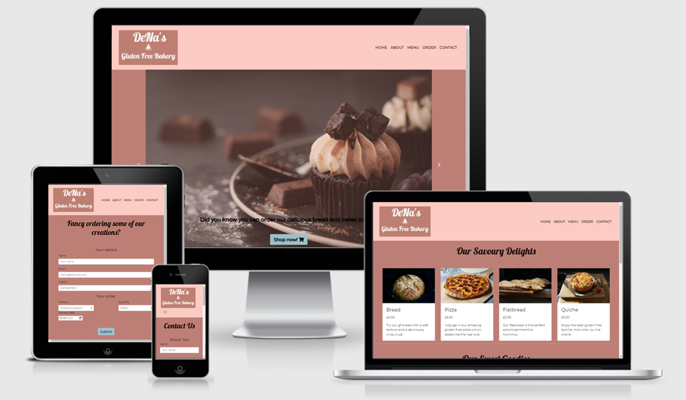
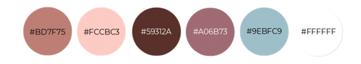

<h1> DeNa's Bakery</h1>

## 

[View the live site here](https://bkoi.github.io/denas-bakery/)

# Project Goal

DeNa's Bakery has been created to provide an online shop for people who either cannot consume gluten free bakery products due to their gluten sensitivity, wheat allergy or coeliac disease, or they refrain from eating gluten as a part of their lifestyle choice. It promotes delicious, freshly-baked, savoury and sweet gluten-free bakery products made by using only quality ingredients. All the creations are made in a gluten-safe way so no cross-contamination can occur which makes these goodies safe and enjoyable even for customers with coeliac disease. Customers are offered the option to submit their orders online, alternatively, they can also pop into the shop to purchase some of the creations. By completing an online form, catering can be ordered for garden parties, barbeques or smaller events at home.

The intuitive navigation and the current features make the user experience seamless and enjoyable.

This project is for educational purposes only and has been created for the User-centric Front End Development module of Code Institute.

---

## User Experience (UX)

* ### User stories
    * #### First Time Visitor Goals
        1.  As a First Time Visitor, I want to understand the profile of this online shop.
        1. As a First Time Visitor, I want to easily navigate the site and browse the products on offer.
        1. As a First Time Visitor, I want to view the menu, submit my order online and check how I can contact the seller.
        1. As a First Time Visitor, I want to check the company's social media presence and I expect that these links will open in separate tabs.
        1. As a First Time Visitor, I want to ensure that I can trust the gluten free nature of these products so I expect to see a disclaimer about this.

    * #### Returning Visitor Goals
        1. As a Returning Visitor, I want to find the products I usually order quickly, with their price displayed.
        1. As a Returning Visitor, I want to select the date of delivery for my order.
        1. As a Returning Visitor, I want to receive a confirmation once my order has been placed.
        1. As a Returning Visitor, I want to be able to contact the seller if I have any queries.

    * #### Frequent User Goals
        1. As a Frequent User, I want the website to work well on tablet and mobile as I prefer submitting my orders on the go.

* ### Design
    * #### Color Scheme
        My final color palette was inspired by the one found on [Easil](https://about.easil.com/how-to-create-a-stunning-color-palette-with-just-an-image/) which has a considerably better good contrast ratio as you can see below.

        

        * #fccbc3: This bright and playful, baby pink background color provides a good contrast with black, because the earth-toned color, #59312a would not have provided a proper contrast. My choice of background color emphasizes that eating bakery products can still be fun and without any pain, allergic reactions or suffering which are the symptoms of gluten sensitivity and coeliac disease. 
        * #000000: After deciding not to use #59312a as my main text color, I cast my vote on black for a better contrast.
        * #9ebfc9 and #a06b73: These colours were used for my call-to-action buttons to provide an upbeat contrast with their backgound color or image.
    * ### Typography
        After trialling potential font styles on [Google Fonts](https://fonts.google.com/), I decided to create my logo with the [Lobster](https://fonts.google.com/?query=Lobster) font as it looks playful and its handwritten nature give authenticity to my logo/brand. Out of the suggested pairings, [Montserrat](https://fonts.google.com/specimen/Lobster?query=Lobster#pairings) seemed to be the most suitable one to create the illusion of space and lightness on the website, I later added [Lato](https://fonts.google.com/specimen/Lato?query=lato#pairings) as an alterantive font style. [Give You Glory](https://fonts.google.com/specimen/Give+You+Glory?category=Handwriting#pairings) was used to create the signature on the Our Story section.
    * ### Icons
        In order to create a simple, yet effective style, I only used a few icons from the [Font Awesome](https://fontawesome.com/) library. I relied on them to make the website visually more appealing, for example, by using social media icons or a hamburger icon to make the UI design sleeker on mobile devices.
    * ### Structure
        I utilised [Bootstrap](https://getbootstrap.com/docs/4.6/getting-started/introduction/) to create the overall structure of my website. As it includes useful elements of CSS styling and JavaScript, I could ensure that my page kept a good structure on all viewports, includes mobiles.

* ### Wireframes

    I used [Balsamiq](https://balsamiq.com/wireframes/desktop/docs/) when creating the wireframes for my website. I started with designing the layout of the desktop view, then moved onto creating my tablet wireframe, while keeping in mind what my website would look like on a mobile device before finalising its design on the wireframe. I redesigned my wireframes a couple of times until I was satisfied that there was not too much information crammed onto each page and the layout enabled a pleasant user experience. My wireframes can be accessed below.

    #### Desktop Wireframe - [View](./wireframes/desktop-wireframe.png)
    #### Tablet Wireframe - [View](./wireframes/tablet-wireframe.png)
    #### Mobile Wireframe - [View](./wireframes/mobile-wireframe.png)
---
## Features
* ### Responsive on all device sizes

### Existing Features

### Features Left to Implement
---
## Technologies Used

### Languages Used
- [HTML5](https://en.wikipedia.org/wiki/HTML5)
- [CSS3](https://en.wikipedia.org/wiki/CSS)

### Frameworks, Libraries and Tools Used
1. [Bootstrap 4.6.0:](https://getbootstrap.com/docs/4.6/getting-started/introduction/)
    Bootstrap was used to enable the responsiveness and assist with the styling of the website.
1. [jQuery:](https://jquery.com/)
    jQuery was part of the Bootstrap bundle and was incorporated in order to make the navbar responsive.
1. [Balsamiq:](https://balsamiq.com/wireframes/)
    Balsamiq was used to create the wireframes for the design before implementing them.
1. [Google Fonts:](https://fonts.google.com/)
    Google Fonts provided the inspiration for my font choices.
1. [Font Awesome:](https://fontawesome.com/)
    The icons came from this website.
1. [Git:](https://git-scm.com/)
    Version control was maintained by applying Git via the Gitpod terminal to commit to Git and push to GitHub.
1. [GitPod:](https://www.gitpod.io/)
    The GitPod environment was used to develop the code before committing and pushing it to GitHub.
1. [GitHub:](https://github.com/)
    GitHub was utilised to store the project's code.

---
## Testing

### Validator Testing
1. [W3C Markup Validator](https://jigsaw.w3.org/css-validator/#validate_by_input) - [Results]()
1. [W3C CS Validator](https://jigsaw.w3.org/css-validator/#validate_by_input) - [Results]()

### Unfixed Bugs
---
## Deployment

### GitHub Pages
The site was deployed to GitHub pages. The steps to deploy are as follows:

### Forking the GitHub Repository

### Making a Local Clone

---
## Credits

### Code

I took some code snippets from [MDN Web Docs moz://a](https://developer.mozilla.org/), from [Codecademy](https://www.codecademy.com/), from [W3Schools](https://www.w3schools.com/), from [Quentin Watt Tutorials](https://www.youtube.com/channel/UCtGGGu_hp8ToQ9BR6Vni19w), from [CI tutorials](https://learn.codeinstitute.net/ci_program/diplomainsoftwaredevelopment), from [Bootsnipp](https://bootsnipp.com/snippets/VgVDB), from [OSTraining] (https://www.ostraining.com/blog/coding/responsive-google-maps/), [CSS Tricks](https://css-tricks.com/couple-takes-sticky-footer/).

### Content

The color scheme was inspired by [Easil](https://about.easil.com/how-to-create-a-stunning-color-palette-with-just-an-image/) to ensure better color contrast.

Some of the scripts used in the menu section can be found on [The Loopy Whisk](https://theloopywhisk.com/2020/04/02/ultimate-gluten-free-bread/), on [Immigrant's Table](https://immigrantstable.com/raspberry-mini-pavlovas/), on [Gluten Free on a Shoestring](https://glutenfreeonashoestring.com/gluten-free-carrot-cake-cupcakes/)

### Media

The pictures on the website originate from [Unsplash](https://unsplash.com/) and [Pexels](https://www.pexels.com/)

### Acknowledgements

